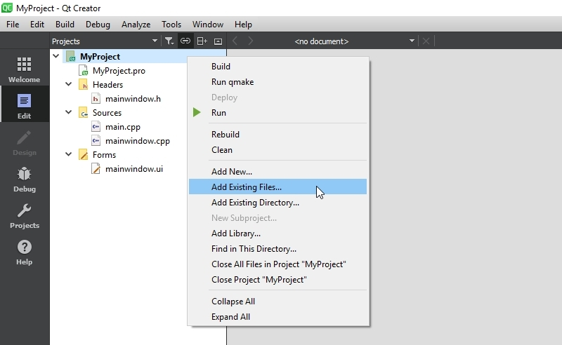
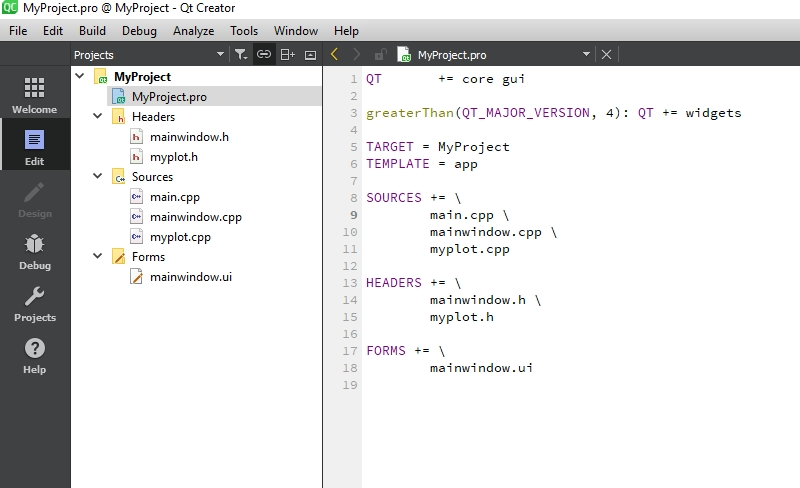
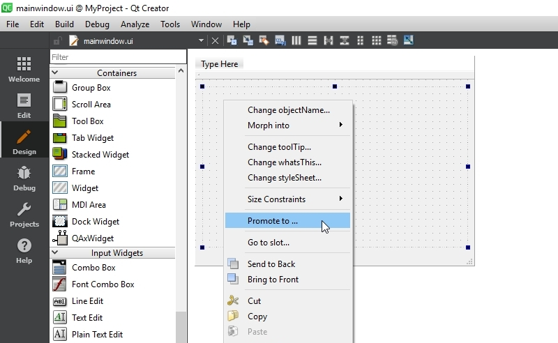
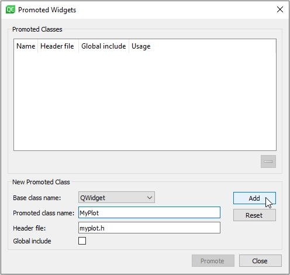

# My Plot

"My Plot" is a simple Qt widget for plotting. It has no dependencies  on external libaries and can be easily integrate in Qt projects. 

To get "My Plot" to work with your Qt application:

- Download the latest version of "My Plot" and copy the myplot.cpp and myplot.h file to your application directory
- In Qt Creator right click on the root entry of your project in the left sidebar and choose *Add Existing Files...*   

- In the dialog, select the myplot.cpp and myplot.h file, to add them to your project  

- Next, place a QWidget on your form, right click on it and click *Promote to...*  

- In the dialog, enter *MyPlot* in the *Promoted Class Name* input field. The input next to *Header File* should be filled automatically with myplot.h. Click "Add" to add Mylot to the promoted classes list and finally click *Promote* to turn the QWidget on your form into a *MyPlot*

- You won't see any immediate visual changes in Qt Creater, but while running the application, you will see an empty plot with axes
