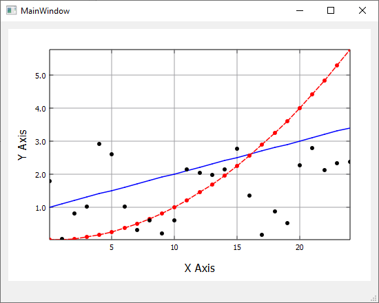

# My Plot

"My Plot" is a simple Qt widget for plotting. It has no dependencies  on external libaries and can be easily integrate in Qt projects. 

<p align="center">
  
</p>

## Contents

- [Setting Up](#setting-up)
- [Plotting](#plotting)

## Setting Up

To get "My Plot" to work with your Qt application:

- Download the latest version of "My Plot" and copy the myplot.cpp and myplot.h file to your application directory
- In Qt Creator right click on the root entry of your project in the left sidebar and choose *Add Existing Files...*:

<p align="center">
  
</p>

- In the dialog, select the myplot.cpp and myplot.h file, to add them to your project. Your project structure and .pro file should look something like this:
<p align="center"></p>

- Next, place a QWidget on your form, right click on it and click *Promote to...* <br>
<p align="center"></p>

- In the dialog, enter *MyPlot* in the *Promoted Class Name* input field. The input next to *Header File* should be filled automatically with myplot.h. Click "Add" to add Mylot to the promoted classes list and finally click *Promote* to turn the QWidget on your form into a *MyPlot*.
<p align="center"></p>

- You won't see any immediate visual changes in Qt Creater, but while running the application, you will see an empty plot with axes


## Plotting

If you have promoted a widget in QtCreator, you'll likely access the respective widget via ui->plot, 
or whatever name you gave the widget, instead.

To make any kind of changes to the plot appear on screen, call ui->plot->update(). 
Note that a replot will automatically happen when the widget is resized and when the built-in user interactions are triggered. Such user interactions are for example dragging the axis ranges with the mouse and zooming with the mouse wheel.


```c++

// generate data
QVector<double> X, Y;
for (int i = 0; i < 25; i++)
{
	X.append(i);
	Y.append(i*i);
}

// plot data
ui->plot->plotXY(X, Y);

// give axes some labels
ui->plot->setXLabel("X Axis", 12);
ui->plot->setYLabel("Y Axis", 12);


