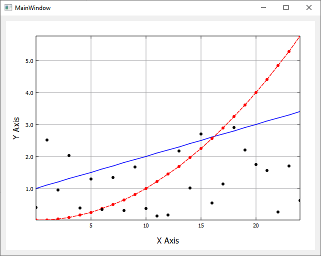
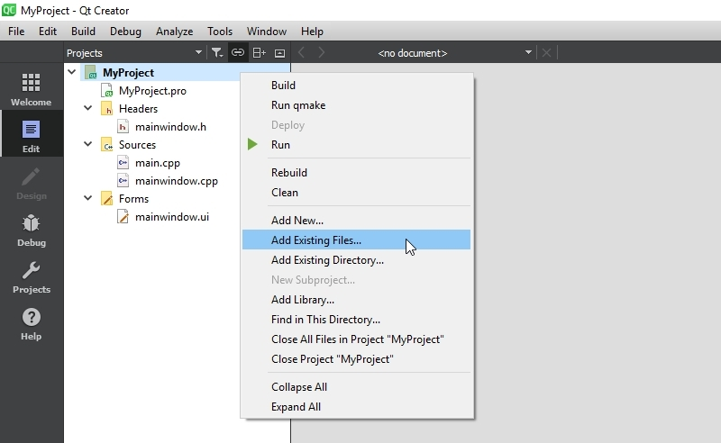
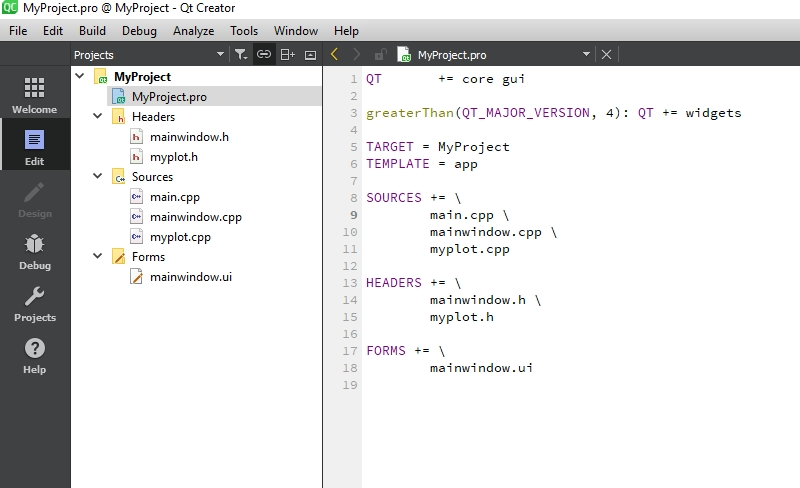
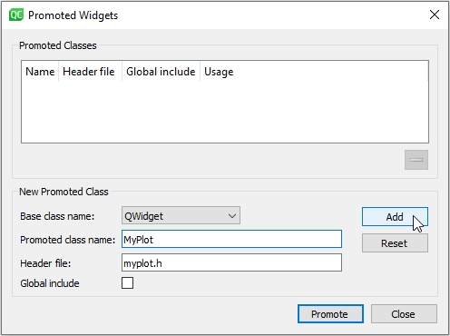
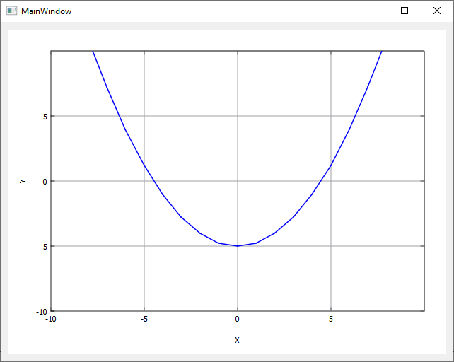

# MyPlot

MyPlot is a simple and lightweight Qt widget for plotting. 
It has no further dependencies on external libaries and can be easily integrated in Qt projects. 

<p align="center">
	
</p>

## Contents

- [Setting Up](#setting-up)
- [Plotting](#plotting)

## Setting Up

To get MyPlot to work with your Qt application download the latest version of MyPlot and copy the myplot.cpp and myplot.h 
file to your application directory. 
In Qt Creator right click on the root entry of your project in the left sidebar and choose *Add Existing Files...*:

<p align="center">
	
</p>

In the dialog, select the myplot.cpp and myplot.h file, to add them to your project. Your project structure and .pro file should look something like this:
<p align="center"></p>

Next, place a QWidget on your form, right click on it and click *Promote to...* <br>
<p align="center">
	
</p>

In the dialog, enter *MyPlot* in the *Promoted Class Name* input field. The input next to *Header File* should be filled automatically with myplot.h, then click "Add" to add Mylot to the promoted classes list and finally click *Promote* to turn the QWidget on your form into a *MyPlot*.
<p align="center">
	
</p>

You won't see any immediate visual changes in Qt Creater, but while running the application, you will see an empty plot with axes.
We recommend to rename the widgets *objectName* to, e.g., `plot`. You might also change the *centralWidget* layout to vertical or horizontal.

## Plotting

If you have promoted a widget in QtCreator, you'll access the respective widget via `ui->plot`, 
or whatever name you gave the widget.

To make any kind of changes to the plot appear on screen, call `ui->plot->replot()`. 
Note that replot is automatically called when the widget is resized. 


```c++

// Generate some data
QVector<double> X, Y;
for (int i = -10; i <= 10; i++)
{
	X.append(i);
	Y.append(0.25*i*i-5);
}

// Plot the data
ui->plot->plotXY(X, Y);
// Set axes labels
ui->plot->setXLabel("X");
ui->plot->setYLabel("Y");
// Set axes ranges
ui->plot->setAxes(-10, 10, -10, 10);

ui->plot->replot();
```

<p align="center">
	
</p>

A more elaborated example is available within this repository.


